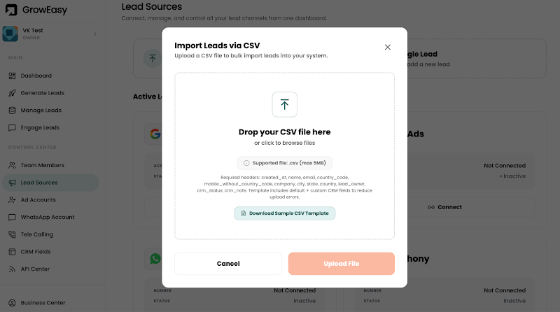
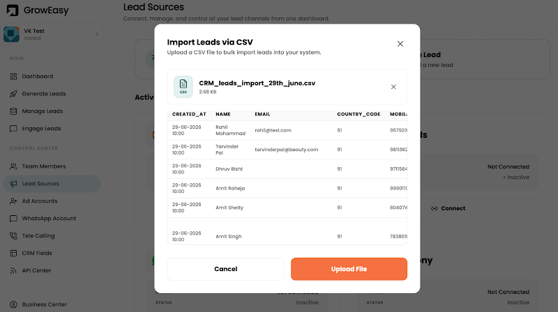
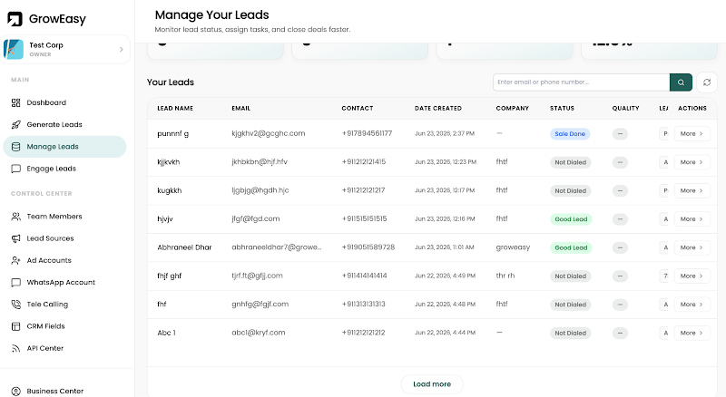

# GrowEasy AI-Powered CSV CRM Importer

An intelligent CSV Importer built to extract and standardize CRM lead details from any arbitrary CSV structure using Google Gemini AI. 

This repository contains both a responsive **Next.js Frontend** and a **Node.js Express Backend** that maps raw column attributes to standard GrowEasy CRM fields.

<p align="left">
  
  
  
  
  
  
  
  
</p>

---

## 📷 Screenshots

### 1. Lead Sources Overview


### 2. CSV Import Wizard


### 3. Lead Management Dashboard


---

## 🌟 Key Features

- **Messy Data Resilience**: Handles exports from Facebook Ads, Google Ads, arbitrary Excel sheets, and custom CRMs, mapping field variations (e.g., "Full Name", "Lead Name", "first_name", "phone", "contact") to the standard CRM schema.
- **Modern Glassmorphic UI**: Beautiful dark-mode dashboard themed around GrowEasy's palette, utilizing responsive styling, clean layouts, and smooth animations.
- **Client-Side CSV Preview**: Fast local parsing (using PapaParse) and table previews with scrollbars and sticky headers prior to any AI execution.
- **Intelligent LLM Batching**: Sends lead batches to Gemini (`gemini-2.0-flash`) using JSON schema modes to ensure high speed, structured responses, and strict compliance with CRM constraints.
- **Enforced CRM Schemas**:
  - **Standardized Statuses**: Classifies raw statuses into `GOOD_LEAD_FOLLOW_UP`, `DID_NOT_CONNECT`, `BAD_LEAD`, or `SALE_DONE`.
  - **Standardized Data Sources**: Restricts origins to allowed listings (`leads_on_demand`, `meridian_tower`, `eden_park`, etc.).
  - **Valid Dates**: Enforces JS `Date`-compatible formats for `created_at`.
  - **Information Consolidation**: Collects remarks, secondary emails, and alternate phone numbers directly into `crm_note`.
  - **Validation Filtering**: Safely skips records that lack both an email and a phone number.
- **Actionable Results & Exporting**: Highlights metrics, successfully mapped records, and skipped rows, with immediate download capabilities as **CSV** or **JSON**.
- **Simulation Fallback Mode**: If no Gemini API key is supplied, the backend seamlessly switches to a rule-based simulation mode so the system works instantly out-of-the-box.

---

## 🛠️ Tech Stack

- **Frontend**: Next.js 15, React 19, TypeScript, Vanilla CSS (with Geist Sans & Mono typography), Lucide Icons, PapaParse.
- **Backend**: Node.js, Express, Multer (in-memory file handling), `@google/genai` (Official Google Gemini SDK), PapaParse, Dotenv.

---

## 🚀 Getting Started

### Prerequisites

Ensure you have [Node.js](https://nodejs.org/) (v18+) and `npm` installed.

### 1. Installation

From the root project directory, run the workspace setup script to automatically install all dependencies for both the frontend and backend:

```bash
npm run install:all
```

### 2. Environment Configuration

Navigate to the `backend/` directory, duplicate the `.env.example` file to `.env`, and set your Google Gemini API key:

```env
PORT=5000
GEMINI_API_KEY=your_gemini_api_key_here
```

> 💡 **Note**: If `GEMINI_API_KEY` is left blank, the application will run in **Simulation Mode** (deterministic header search) so you can still preview and interact with the application.

### 3. Launch Development Servers

Start both the frontend Next.js server (`http://localhost:3000`) and the backend Express server (`http://localhost:5000`) concurrently by running this command in the root folder:

```bash
npm run dev
```
 
### 4. Running with Docker (Alternative)

If you prefer to run the application in isolated Docker containers, you can boot both services concurrently using Docker Compose:

```bash
docker-compose up --build
```

The frontend will be exposed at `http://localhost:3000` and the backend at `http://localhost:5000`. Environment variables are loaded automatically from `backend/.env`.

---

## 📂 Project Structure

```text
GROWeasy/
├── assets/                   # Project screenshots & assets
├── backend/                  # Node.js Express Backend
│   ├── .env.example
│   ├── package.json
│   └── server.js             # API handling, CSV parsing & Gemini logic
├── frontend/                 # Next.js 15 Frontend (App Router)
│   ├── src/
│   │   └── app/
│   │       ├── globals.css   # Main CSS & custom styling utilities
│   │       ├── layout.tsx    # Head & font definitions
│   │       └── page.tsx      # Multi-step CSV upload & results page
│   ├── package.json
│   └── tsconfig.json
├── package.json              # Root script orchestrator
└── README.md
```

---

## 🤖 CRM Schema Details

The backend and Gemini prompts enforce the following target schema:

| Field | Description | Rules / Mapping |
|---|---|---|
| `created_at` | Lead creation date | Enforced date string parseable by `new Date()` |
| `name` | Lead full name | Raw name columns |
| `email` | Primary email | First email found (extras appended to `crm_note`) |
| `country_code` | Phone country code | Extracted country code (e.g. `+91`) |
| `mobile_without_country_code` | Primary phone | First phone found (extras appended to `crm_note`) |
| `company` | Company name | Mapped from employer/company tags |
| `city` / `state` / `country` | Location | Extracted geographical components |
| `lead_owner` | Owner email | Mapped from source owners |
| `crm_status` | Lead standing | Standardized to: `GOOD_LEAD_FOLLOW_UP`, `DID_NOT_CONNECT`, `BAD_LEAD`, or `SALE_DONE` |
| `data_source` | Campaign/Channel | Validated list: `leads_on_demand`, `meridian_tower`, `eden_park`, `varah_swamy`, `sarjapur_plots` |
| `crm_note` | Remarks & Extras | Consolidated secondary numbers, secondary emails, and raw comments |
| `possession_time` | Property possession time | Captured if available |
| `description` | Extra lead description | General details |

---

## 🎯 Submission Checklist

- **Hosted application URL**: [To be deployed by user]
- **GitHub repository URL**: https://github.com/LEVELING2108/GROWeasy.git
- **Position applied for**: Software Developer (Intern / Full-Time)
- **Submit to**: `varun@groweasy.ai`
